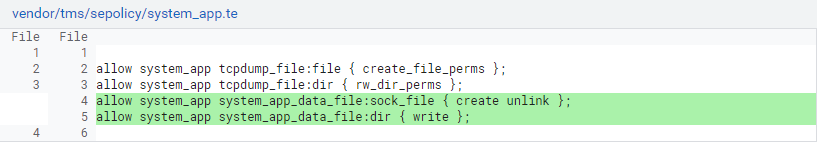
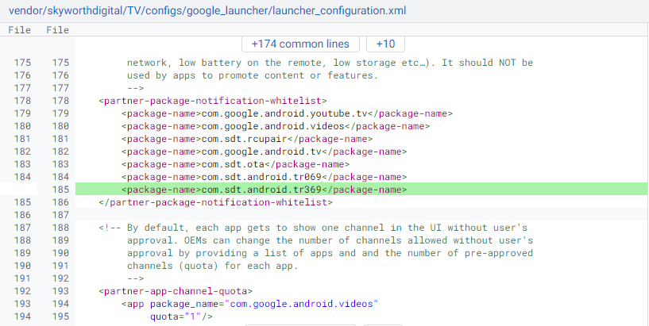

#### SdtTr369


##### 应用信息

...

##### 集成说明

1. 权限相关

   由于TR369与TR069在业务部分处理一致，都完成同样的业务需求，因此TR369需要保留原TR069的全部权限设置，并在此基础上新增以下内容：

   ```
   allow system_app system_app_data_file:sock_file { create unlink };
   allow system_app system_app_data_file:dir { write };
   
   ## 配置selinux权限
   # allow xxx(主体) yyy(目标):类型 { 权限 };
   ## 关闭selinux检查
   # adb shell setenforce 0
   ```

   


2. 配置相关

   TR369会从盒子中路径为：`/vendor/etc/skyconfig/config.properties` 的文件里查询相关配置项。

   平台配置项设置：

   ```
   tms_url=https://172.28.11.232
   tms_operator_name=platform
   tms_tr369_port=18369
   ```


3. 系统配置

   在TR369中基于MQTT实现的Launcher短消息通知功能需要将包名添加至谷歌的通知白名单中。

   


4. 应用集成

   修改`vendor/tms/apps/SdtTr369/`下的`Android.mk`文件，添加TR369相关的编译选项：

   ```
   LOCAL_PATH := $(my-dir)
   
   include $(CLEAR_VARS)
   LOCAL_MODULE := SdtTr369
   LOCAL_SRC_FILES := $(LOCAL_MODULE).apk
   LOCAL_MODULE_CLASS := APPS
   LOCAL_MODULE_SUFFIX := .apk
   LOCAL_MODULE_TARGET_ARCH := arm
   LOCAL_CERTIFICATE := platform
   LOCAL_VENDOR_MODULE := false
   LOCAL_ENFORCE_USES_LIBRARIES := false
   LOCAL_POST_INSTALL_CMD := mkdir -p "$(TARGET_OUT)/etc/skyscripts"; \
                             cp -rf "$(LOCAL_PATH)/script/tr369_script.sh" "$(TARGET_OUT)/etc/skyscripts/"; \
                             cp -rf "$(LOCAL_PATH)/script/log" "$(TARGET_OUT)/etc/skyscripts/"; \
                             mkdir -p "$(TARGET_OUT)/etc/init"; \
                             cp -rf "$(LOCAL_PATH)/script/init.tr369.scripts.logcat.rc" "$(TARGET_OUT)/etc/init/"; \
                             cp -rf "$(LOCAL_PATH)/script/init.tr369.scripts.tcpdump.rc" "$(TARGET_OUT)/etc/init/"
   
   include $(BUILD_PREBUILT)
   ```

5. 系统补丁

   TR369中有些功能（Lock状态下限制按键、新增获取Ethernet使用率接口、Bug Report功能拓展、APP黑白名单限制等等）需要frameworks做一些改动，这些改动以patch的形式存放在 `patch/function/` 中，每个补丁均对应一个功能或需求。为了保证TR369功能的完善，建议把 `patch/function/` 目录下所有的补丁都打上。

   PS：`patch/integration/` 目录下的patch文件为不同平台下，TR369不同的集成方式，项目在集成时可参考该目录下的补丁。

6. 证书集成

   TR369为了确保默认证书不泄露，已将证书内容写进应用jni中，但是如果项目需要使用自己的证书，可将证书文件以规定的命名放到盒子的规定目录中：

   ```
   CaCert: 	vendor/etc/security/certs/TR369CaCert.pem
   ClientCert:	vendor/etc/security/certs/TR369ClientCert.pem
   ClientKey: 	vendor/etc/security/certs/TR369ClientKey.pem
   ```

   并在 `vendor/tms/products/tms.mk` 中配置上证书文件：

   ```
   PRODUCT_PACKAGES := SdtTr369
   
   PRODUCT_COPY_FILES += \
       vendor/tms/sepolicy/certs/TR369CaCert.pem:$(PRODUCT_OUT)/vendor/etc/security/certs/TR369CaCert.pem \
       vendor/tms/sepolicy/certs/TR369ClientCert.pem:$(PRODUCT_OUT)/vendor/etc/security/certs/TR369ClientCert.pem \
       vendor/tms/sepolicy/certs/TR369ClientKey.pem:$(PRODUCT_OUT)/vendor/etc/security/certs/TR369ClientKey.pem
   ```

   PS：这些证书文件仅在业务层执行数据上传功能时使用，例如：开机请求MQTT配置功能、上传截图/录屏/日志/实时日志功能、网络测速功能等等。协议层的证书不使用上述证书，而是使用开机请求MQTT配置功能时服务器下发的SSL证书。


##### 定制化需求

1. 增删节点

   节点列表存放文件：`app/src/main/assets/sdt_tms_tr369_model.xml`
   
   请在节点列表的xml文件中，按照规定的格式添加节点。
   
   参数说明：
   
   * name：节点名字
   * getter/setter：Get/Set调用者，固定值为diagnose
   * default：节点的固定值，代表节点固定为所设定的值，因此无需再配置getter/setter参数
   * type：节点类型，值可能为以下几种：
     * string/boolean/int/unsignedInt/long/unsignedLong/dateTime/base64/hex/decimal：根节点类型
     * object：非根节点类型，代表此处name对应的节点并非根节点
     * multipleNumber：要与 table参数配合使用，用于存储multipleObject的单节点数量，对应的name参数命名后缀固定为"...NumberOfEntries"
     * multipleObject：复合节点，代表此节点是由多个单节点组成的复合节点，单个节点的下标由{i}控制
   * table：type设为multipleNumber时使用，指明需要绑定的复合节点名称
   * 其他参数暂无用途（例如write/constraint/inform），可以不设置
   
   复合节点创建方式如下：
   
   ```
   <schema name="Device" type="object">
       <schema name="X_Skyworth" type="object">
           <schema name="AppNumberOfEntries" table="Device.X_Skyworth.App.{i}" type="multipleNumber" />
           <schema name="App.{i}" type="multipleObject">
               <schema name="Type" getter="diagnose" type="string" />
               <schema name="PackageName" getter="diagnose" type="string" />
               <schema name="Name" getter="diagnose" type="string" />
               <schema name="Version" getter="diagnose" type="string" />
               <schema name="BlockStatus" getter="diagnose" setter="diagnose" type="boolean" />
               <schema name="BlockEnable" getter="diagnose" type="boolean" />
               <schema name="StopEnable" getter="diagnose" type="boolean" />
               <schema name="Size" getter="diagnose" type="int" />
               <schema name="Running" getter="diagnose" setter="diagnose" type="boolean" />
               <schema name="isUpdatedSystem" getter="diagnose" type="string" />
               <schema name="LastUpdatedTime" getter="diagnose" type="string" />
               <schema name="MemoryUsage" getter="diagnose" type="string" />
               <schema name="StorageUsage" getter="diagnose" type="string" />
               <schema name="Uptime" getter="diagnose" type="string" />
               <schema name="TotalUptime" getter="diagnose" type="string" />
               <schema name="RunningTimes" getter="diagnose" type="string" />
               <schema name="LastStartTime" getter="diagnose" type="string" />
               <schema name="CpuUsage" getter="diagnose" type="string" />
               <schema name="ClearData" getter="diagnose" setter="diagnose" type="boolean" />
               <schema name="PermissionsNumberOfEntries" table="Device.X_Skyworth.App.{i}.Permissions.{i}" type="multipleNumber" />
               <schema name="Permissions.{i}" type="multipleObject">
                   <schema name="Name" getter="diagnose" type="string" />
                   <schema name="Label" getter="diagnose" type="string" />
                   <schema name="Granted" getter="diagnose" setter="diagnose" type="string" />
                   <schema name="CanModify" getter="diagnose" type="boolean" />
               </schema>
           </schema>
       </schema>
   </schema>
   ```

2. 节点默认值

   在第一次开机、恢复出厂设置或者系统升级后，部分节点将使用默认值完成初始化，这些默认值统一由 `app/src/main/assets/sdt_tms_tr369_model.default` 进行管理。

   编写规则：每一行以节点名称（完整路径）为开头，空格作为分隔，节点的值用双引号指出，注释符为`#`号。

   例如：

   ```
   ### Adding boot params
   Device.LocalAgent.Controller.1.BootParameter.1.Enable "true"
   Device.LocalAgent.Controller.1.BootParameter.1.ParameterName "Device.LocalAgent.EndpointID"
   Device.LocalAgent.Controller.1.BootParameter.2.Enable "true"
   Device.LocalAgent.Controller.1.BootParameter.2.ParameterName "Device.DeviceInfo.SerialNumber"
   
   ### LocalAgent.Controller configuration
   Device.LocalAgent.Controller.1.EndpointID "self::sdtacs-ABC369"
   
   ### Add by Skyworth
   ## 运营商编号
   Device.DeviceInfo.ManufacturerOUI "309176"
   ## 新盒子锁的状态
   Device.X_Skyworth.Lock.Enable "0"
   ## 平台软件默认不开启logcat后台持续保存日志功能，按项目需求打开或关闭
   Device.X_Skyworth.Logcat.Background.Enable "1"
   ## 平台软件默认不开启logcat自动上传日志功能，按项目需求打开
   Device.X_Skyworth.Logcat.AutoUpload.Enable "0"
   ## 位置信息相关参数
   Device.DeviceInfo.Location.1.Source "External"
   Device.DeviceInfo.Location.1.ExternalProtocol "CWMP"
   Device.DeviceInfo.Location.1.ExternalSource "https://ipinfo.io/json"
   Device.DeviceInfo.Location.1.DataObject ""
   Device.DeviceInfo.Location.1.AcquiredTime ""
   ```

3. 事件类型节点

   新建事件方法：

   文件位置：`tr369/src/main/cpp/openTr369/vendor/vendor_event.c`

   初始化函数：`int SK_TR369_InitCustomEvent() {}`

   使用obuspa源码提供的api：`USP_REGISTER_SyncOperation` 进行初始化，参数 `path` 指定事件的节点名称，参数 `sync_oper_cb` 指定事件对应的函数入口，事件函数规则：`typedef int (*dm_sync_oper_cb_t)(dm_req_t *req, char *command_key, kv_vector_t *input_args, kv_vector_t *output_args);`

   例如：

   ```
   int SK_TR369_Start_UploadFile(dm_req_t *req, char *command_key, kv_vector_t *input_args, kv_vector_t *output_args)
   {
       int err = USP_ERR_OK;
       char param[1024] = {0};
       // Input variables
       char *input_file_type, *input_delay_seconds, *input_url;
   
       // Extract the input arguments using KV_VECTOR_ functions
       input_file_type = USP_ARG_Get(input_args, "FileType", "");
       input_delay_seconds = USP_ARG_Get(input_args, "DelaySeconds", "");
       input_url = USP_ARG_Get(input_args, "Url", "");
   
       USP_LOG_Debug("%s: FileType: %s, DelaySeconds: %s, Url: %s",
                     __FUNCTION__, input_file_type, input_delay_seconds, input_url);
   
       ...
   
       // Save all results into the output arguments using KV_VECTOR_ functions
       char status[16], message[256];
       SK_TR369_GetDBParam("Device.X_Skyworth.UploadResponse.Status", status);
       SK_TR369_GetDBParam("Device.X_Skyworth.UploadResponse.Message", message);
   
       USP_ARG_Add(output_args, "Status", status);
       USP_ARG_Add(output_args, "Message", message);
   
       USP_LOG_Info("%s: Status: %s, Message: %s", __FUNCTION__, status, message);
   
       return err;
   }
   
   int SK_TR369_InitCustomEvent(void)
   {
       int err = USP_ERR_OK;
   
       err |= USP_REGISTER_SyncOperation("Device.X_Skyworth.UploadFile()", SK_TR369_Start_UploadFile);
       ...
   
       return err;
   }
   ```

4. 业务层Get/Set调用接口

   以注释的形式指定Get/Set执行的节点名称。

   例如：

   ```
   import com.sdt.annotations.Tr369Get;
   import com.sdt.annotations.Tr369Set;
   
   @Tr369Set("Device.X_Skyworth.DreamTime")
   public boolean SK_TR369_SetDreamTime(String path, String ms) {
       return Settings.System.putInt(
               GlobalContext.getContext().getContentResolver(),
               SCREEN_OFF_TIMEOUT,
               Integer.parseInt(ms));
   }
   
   @Tr369Get("Device.X_Skyworth.DreamTime")
   public String SK_TR369_GetDreamTime() {
       return String.valueOf(Settings.System.getInt(
               GlobalContext.getContext().getContentResolver(),
               SCREEN_OFF_TIMEOUT,
               (int) (30 * DateUtils.MINUTE_IN_MILLIS)));
   }
   ```

